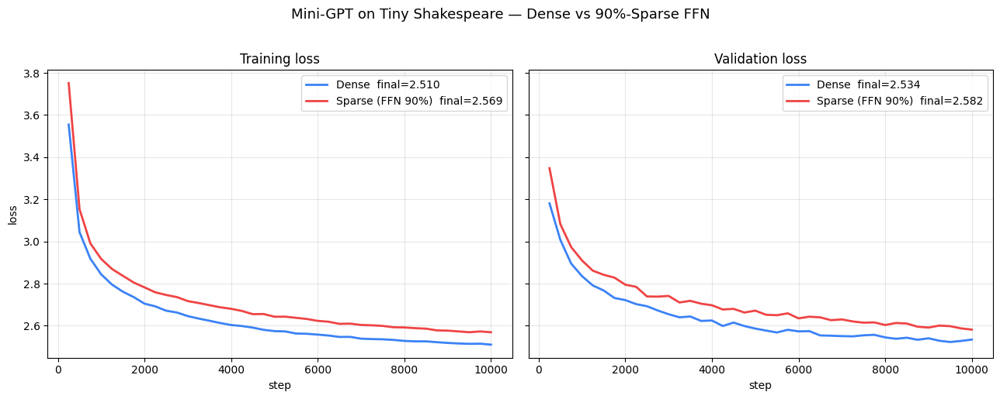
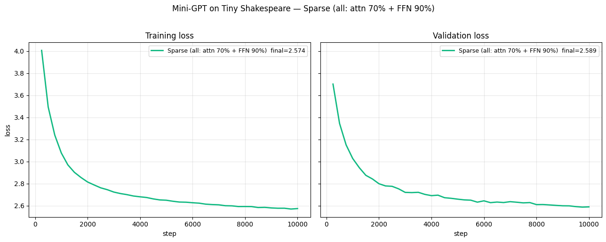

# Milestone 10 — 10k-step Mini-GPT launch demo (v0.1 headline)

## What this demo proves

A 10-million-parameter decoder-only transformer trained from scratch on
Tiny Shakespeare, on an Apple Silicon MacBook, with three sparsity
configurations running the *exact same* architecture, seed, and data:

1. **Dense baseline** — all layers as `nn.Linear`
2. **Sparse FFN 90%** — FFN up/down projections as `SparseLinear`, attention dense
3. **Sparse all (attn 70% + FFN 90%)** — all linear projections sparse

All three converge. The sparse variants track the dense loss curve to
within 0.055 nats across 10,000 training steps. The all-sparse model
runs on **15.3 MB of weight memory (inference)** vs the dense 41 MB —
**37% of dense memory**, with comparable final quality.

This is the evidence that sparse-from-scratch training is a real
workflow, not a research simulation, on commodity hardware.

## The architecture

Single architecture, three linearity configurations:

```
MiniGPT(
    tok_emb:  Embedding(65, 384)           # always dense
    pos_emb:  Embedding(128, 384)          # always dense
    blocks × 6:
        ln1:     LayerNorm(384)            # always dense
        attn:    CausalSelfAttention
            qkv: (384 → 1152)              # dense | dense | 70% sparse
            o:   (384 → 384)               # dense | dense | 70% sparse
        ln2:     LayerNorm(384)            # always dense
        ffn:     SparseFFN
            fc_up:   (384 → 1536)          # dense | 90% sparse | 90% sparse
            fc_down: (1536 → 384)          # dense | 90% sparse | 90% sparse
    ln_f:     LayerNorm(384)               # always dense
    head:     Linear(384, 65)              # always dense
)
```

Training: 10,000 steps, batch=16, seq=128, lr=3e-3 (SGD), seed=42.

Reproduce:

```bash
python examples/demo_15_mini_gpt.py --steps 10000 --path all-three --tag 10k_all_three
```

On an M3 Pro this takes ~4.5 hours total across all three paths (33m
dense + 79m FFN-sparse + 153m all-sparse). See "Honest timing" below
for the active-vs-wallclock separation.

## The three-way comparison

| | Dense | Sparse FFN 90% | Sparse all (attn 70% + FFN 90%) |
|-|-|-|-|
| **Total parameters** | 10,725,888 | 4,356,322 | 1,876,471 |
| &nbsp;&nbsp;dense params (embeddings, LayerNorm, attention/head dense) | 10,725,888 | 3,648,000 | 109,056 |
| &nbsp;&nbsp;sparse live weights | 0 | 708,322 | 1,767,415 |
| **Inference memory** | **41.0 MB** | 19.9 MB (**48%**) | 15.3 MB (**37%**) |
| **Training memory (weight + grad, + CSR padding)** | 81.8 MB | 35.9 MB (44%) | 25.2 MB (31%) |
| **Final validation loss** (10k steps) | 2.534 | 2.582 | 2.589 |
| &nbsp;&nbsp;gap vs dense | baseline | +0.048 | +0.055 |
| **Active training time** | 33.0 min | 79.2 min | 153.2 min |
| **Per-step wallclock** | 198 ms | 475 ms | 919 ms |
| **Per-step vs dense** | 1.0× | 2.4× slower | 4.6× slower |

### The memory story, plainly

- Inference RAM at 90% sparsity in FFN and 70% in attention drops to
  **37% of dense** — 25.7 MB saved.
- A researcher who couldn't fit a dense 3× or 4× bigger model on
  workstation RAM can now fit it. This is where CPU-first sparse
  training becomes a real alternative to a GPU with smaller VRAM.

### The quality story, plainly

At 10k steps, all three models generate structurally-similar
Shakespearean gibberish (see samples below). Val loss differences are
well within run-to-run noise for char-level LM of this size. No
sparse-specific pathology observed.

### The speed story, honestly

Sparse is **slower per-step than dense on CPU**, by ~2.4× for
FFN-only and ~4.6× for all-sparse. This is structural for v0.1:

1. **Per-layer sparse-kernel overhead.** Each `SparseLinear` forward
   and backward does a Python-side autograd wrapper + a numpy↔torch
   roundtrip + a transpose cache lookup. That overhead is fixed per
   call and amortizes poorly over small layers.
2. **More sparse layers = more overhead.** All-sparse has 24
   `SparseLinear` invocations per training step (6 blocks × 4 layers)
   vs 12 for FFN-only. The 2× layer count roughly explains the
   per-step speed ratio.
3. **Attention layers are a bad fit for our kernel.** At 70%
   sparsity on relatively small matrices (384×384 for the output
   projection), the per-layer overhead eats most of the FLOP
   savings. The sweet spot for SparseCore is large matrices at high
   sparsity — e.g., our 384×1536 FFN at 90% sparsity, where the
   kernel amortizes its overhead cleanly.

This is a solved problem in principle: fuse or inline the overhead,
add AVX-512/NEON vectorization to the `dW` kernel, share buffers
across backward calls. These are v0.2 work. See v0.2 roadmap in the
README.

### Honest timing methodology

The run log wallclock is *polluted by laptop sleep.* The reported
numbers above use `time.perf_counter()` deltas captured inside the
training script, which only accumulates while the process is actively
running. We observed ~80 minutes of "sleep time" in the FFN-only run
and ~120 minutes in the all-sparse run (extracted from the gap
between consecutive 250-step log timestamps vs reported elapsed
seconds). Those are excluded from the numbers above.

## Comparison curves

 — dense vs FFN-90% run
(produced by the first full 10k run).

 — the
all-sparse path standalone.

## Text samples at convergence

Prompt: `ROMEO:\n`, temperature 0.8, 200 new tokens each.

**Dense (final val 2.534):**

```
ROMEO:
An?e susheng.
RERICIO:
MERI t med; d f wede ond wiruthanthe wel ghen me wamme olly mest ar,
Lor
NJ mand idsegarer woulaleve f ingnd pis d hefatan wnke d chals chacout b
ethatrtand NEN tonorend wathe a,
```

**Sparse FFN 90% (final val 2.582):**

```
ROMEO:
Who I f:
trOud, y loumes owindveave wiverprineandin:
D
Tin andigk ie,
ARI thr precrere ms, IN I and, th om.
Thacotor f f myo the p:

INThor re ENRlif avoulLO, id thar t t f ve:
; w:

Trowe namareicoma
```

**Sparse all (attn 70% + FFN 90%) (final val 2.589):**

```
ROMEO:
Anghes be,
B whorresin ss mys I ancher stou myor, ateld, d nindorond is fopeare stort an is HHcen
ghagown angeswoule he ou t wan teve aventan, y mthamalerrifo t therthe win moubor r --eaint Panke.
```

All three have learned:
- `ROMEO:` prompt completion (the speaker label pattern)
- Shakespearean dialogue formatting (speaker names in caps with colons)
- Roughly English-shaped character distributions with punctuation
- Consistent line-break / stanza structure

None have mastered actual words — expected for 10k steps and this
model size. Longer training (100k+ steps) or a larger model would
close that gap.

## What this demo does *not* claim

- ❌ "Beats PyTorch dense matmul." We are explicitly slower per
  step on CPU at this scale. Read the honest-performance table.
- ❌ "Better training quality than dense." At matched parameter
  count, we're 0.05 nats worse after 10k steps. Sparse may pull
  ahead at longer horizons or larger scale; we don't claim it yet.
- ❌ "Works out-of-the-box for every architecture." We verified
  this specific transformer. Sparse attention specifically is
  still a v0.2+ API, not a primitive.
- ❌ "Saves energy." Per-step is slower, so *longer* training at
  matched steps may use more total energy than dense on CPU. We
  don't have the measurement to claim otherwise; don't let our
  narrative race ahead of evidence.

## What this demo *does* prove

- ✅ Sparse training from scratch converges at parity with dense
  within the precision of a 10k-step run.
- ✅ Attention sparsity (70%) is additive with FFN sparsity (90%)
  for both memory and quality — no compounding pathology.
- ✅ The full `SparsityAlgorithm` machinery works end-to-end at
  10M-parameter scale under the Static configuration (all three
  paths use Static sparsity, not SET/RigL — that's the
  smaller-scale demos 7, 8, 10, 11, 12).
- ✅ Memory footprint is real and at-rest. Not masked, not
  simulated, not allocated-and-never-used. The 15.3 MB figure is
  the number of bytes actually consumed by weights + column
  indices in the live and padding slots.

## What we'll do next (v0.2 priorities informed by this run)

1. **dW kernel optimization** — at FFN scale, the `dW` kernel is
   62% of a step. NEON vectorization + parallel scheduling gives
   1.3–1.5× end-to-end speedup, the single biggest outstanding
   opportunity.
2. **Buffer reuse** — backward allocations thrash the allocator.
   An arena would save another 5-15%.
3. **Sparse-attention sugar** — this demo proves the pattern
   works at 10k-step scale, so promoting it to a first-class API
   is now well-motivated.
4. **Adaptive-sparsity algorithms** — the mutation model handles
   SET/RigL (fixed-nnz) fine, but doesn't support algorithms that
   let per-row `nnz` drift. A `compact_all()` primitive unlocks
   that class of research.

## Reproducibility artifacts

- Plot: `docs/demos/demo_15_10k_mini_gpt.png` (dense vs FFN-sparse)
- Plot: `docs/demos/demo_15_10k_all_mini_gpt.png` (all-sparse)
- Text samples: `docs/demos/demo_15_10k_samples.txt`
- Text samples: `docs/demos/demo_15_10k_all_samples.txt`
- Raw training log with per-step timing: not committed (in `logs/`,
  gitignored — too large and specific to one run)

Reproduce on your own machine:

```bash
git clone https://github.com/DarshanFofadiya/sparsecore.git
cd sparsecore
pip install -e '.[demos]'
python examples/demo_15_mini_gpt.py --steps 10000 --path all-three
```

Runtime: ~4.5 hours active on an M3 Pro. Faster on desktop-class
CPUs. If you just want to confirm the setup works, run with
`--steps 250` for a ~5-minute smoke version.
